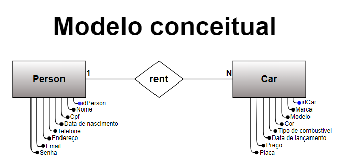

<!DOCTYPE html>
<html>
<head>
    <h1>Projeto Banco De Dados</h1>
</head>
<body>

<h2>Modelagem de banco de dados para o gerenciamento de de informações de carros a venda e seus respectivos proprietários. O sistema tem como objetivo fornecer uma plataforma centralizada para armazenar, acessar e gerenciar detalhes dos carros disponiveis para venda, bem como as informações dos priprietarios associados a esses carros.</h2>
<h4>Como principais, vemos nos modelos a seguir a entidade pessoa contendo todas as informaçoes do proprietario e baseada em dois modelos de acesso para vendedor e cliente para as diferentes funções no sistema. Temos tambem a entidade carro contendo todas as informações descritivas dos carros a venda. Segue o MER do projeto.</h4>

  

  

<h4>Conclusão: O sistema oferece uma solução simples e eficiente para o controle e consultas de carros a venda relacionados diretamente com as informaçoes dos seus respetivos donos, otimizando a experiencia do cliente na busca do produto mais desejado.</h4>
<h3>Plataformas utilizadas no projeto:</h3>
<h4>
<a href="https://dbeaver.io">Dbeaver</a> 
<a href="https://app.diagrams.net">Draw.io</a>
</h4>
</body>
</html>